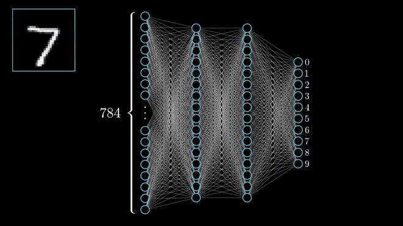
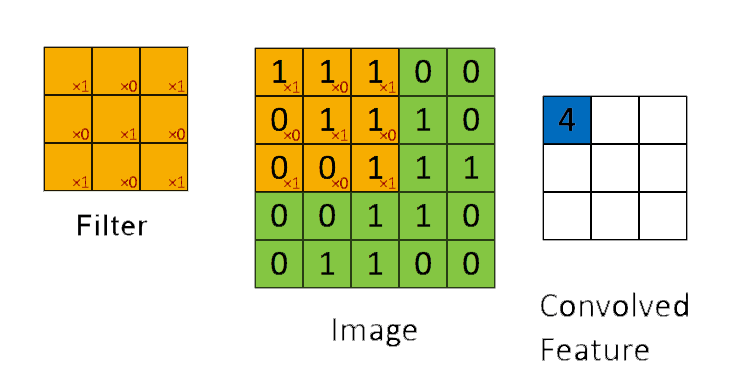
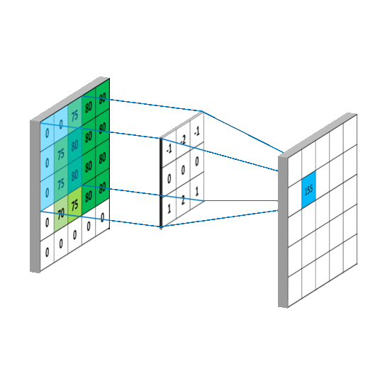
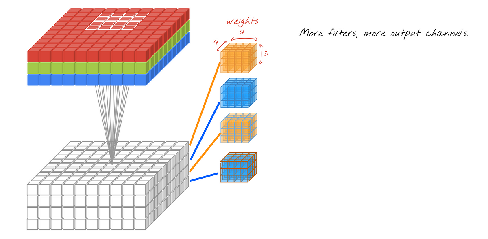
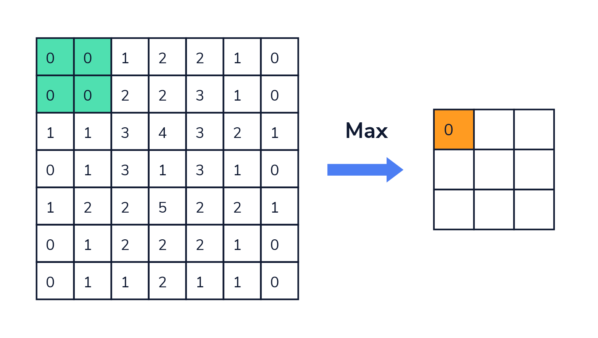
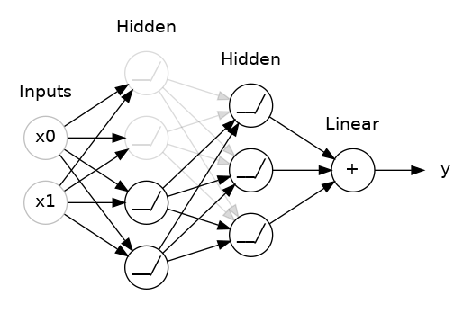
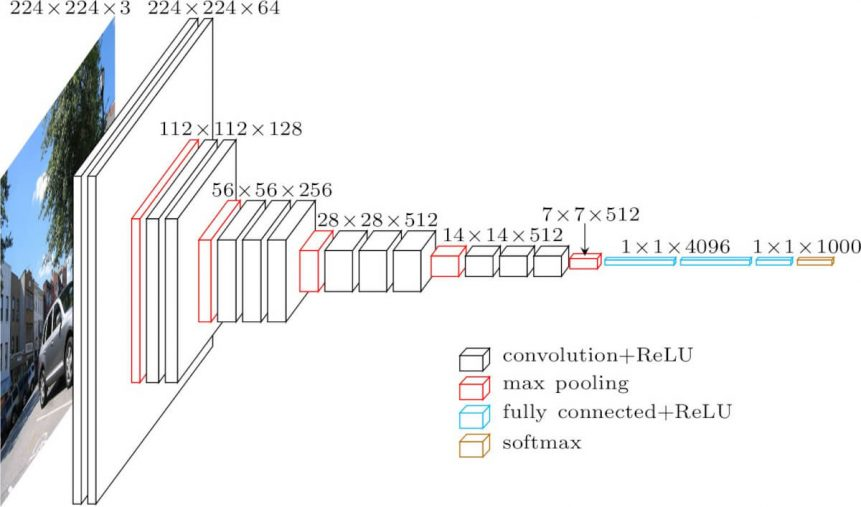
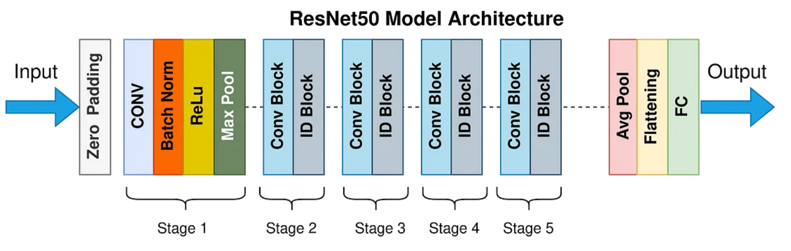

# Neural Network

# Convolution Neural Network

## 2D Convolution

## Maxpool

## Dropout

-------------------------------------------------------------------------------------------
# CNN Architectures
1) VGG16

2) [ResNet : Deep Residual Learning for Image Recognition](https://arxiv.org/pdf/1512.03385.pdf) | [ResNet50](https://towardsdatascience.com/the-annotated-resnet-50-a6c536034758)

ResNet stands for Residual Network. The numbers 18, 34, 50, 101, and 152 in ResNet-18, ResNet-34, ResNet-50, ResNet-101, and ResNet-152 represent the number of layers in these networks

    

